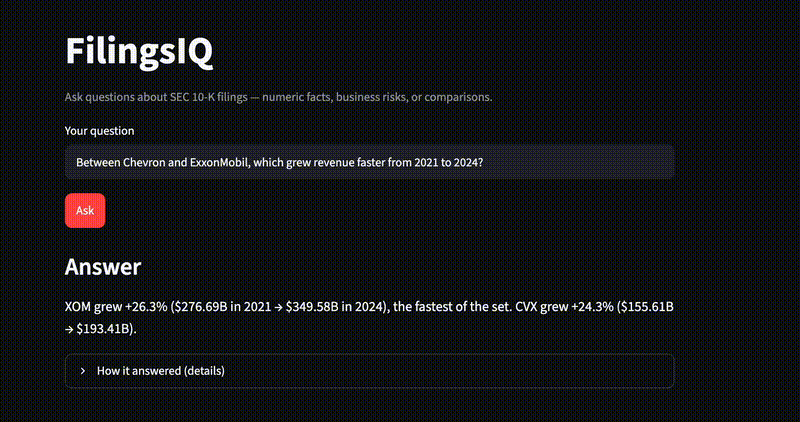
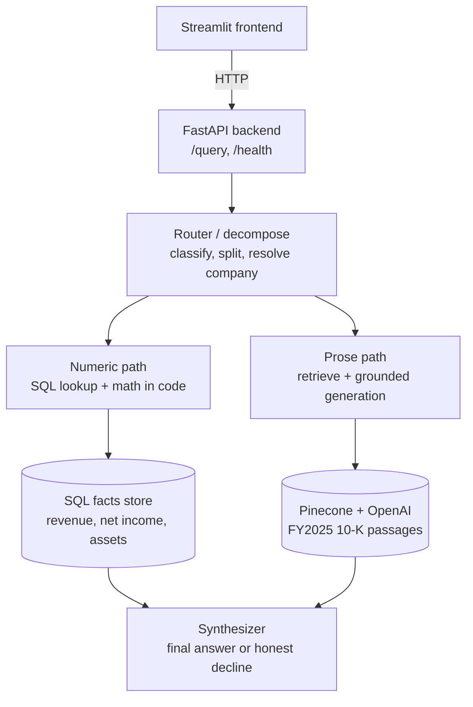

# FilingsIQ — RAG over SEC 10-K Filings

A retrieval-augmented question-answering system over SEC filings that **routes each question to the right method**: exact numeric facts come from a structured SQL store, business/risk questions come from grounded vector retrieval over filing text, and the system **honestly declines** when the filings don't contain the answer rather than fabricating one.

**Live demo:** https://rag-agent-rdqn2q8kuagmnbmoyecmw9.streamlit.app/
_(Free-tier backend — the first request may take ~30s to wake up, then it's fast.)_

<!-- Add your demo GIF here once recorded, e.g.: -->
<!--  -->

---

## What it does

Ask questions about 20 major companies' SEC filings and get answers routed to the appropriate engine:

- **Numeric facts** → *"What was Apple's net income in 2024?"* → `$93.74B`, pulled from a structured facts store (never guessed by an LLM).
- **Growth comparisons** → *"Between Chevron and ExxonMobil, which grew revenue faster from 2021 to 2025?"* → computes both growth rates and names the winner.
- **Business / risk questions** → *"What supply chain risks does Apple face?"* → a grounded, cited answer generated only from retrieved filing passages.
- **Hybrid** → *"What was Apple's 2024 net income, and what risks did they flag?"* → stitches a numeric answer and a prose answer.
- **Honest declines** → *"What was Netflix's revenue?"* → declines, because Netflix isn't in the corpus. The system refuses rather than hallucinate.

## Corpus

- **20 companies** across sectors (tech, finance, energy, healthcare, consumer): AAPL, AMZN, BA, BAC, BRK-B, CVX, GOOGL, JNJ, JPM, KO, META, MSFT, NVDA, PG, T, TSLA, UNH, V, WMT, XOM.
- **Numeric facts** (revenue, net income, total assets) for **FY2021–2025**, stored in a structured SQL table.
- **Prose retrieval** over **FY2025 10-K filings** — 2,503 parent passages indexed in a Pinecone vector store.

## Architecture



The frontend and backend are **independently deployable** — the frontend only depends on the API contract, not the pipeline internals.

**Key design decisions:**
- **Numbers come from SQL, never from an LLM.** Financial figures must be exact, so numeric questions are answered by structured lookups and arithmetic computed in code — the LLM never produces a number.
- **Prose answers are strictly grounded.** Generation is constrained to retrieved passages with citations (`[P1]`, `[P2]`), temperature 0, and an explicit instruction to decline if the passages don't contain the answer.
- **Honest declining is a first-class behavior**, not an edge case — the system refuses out-of-corpus, out-of-range, and unsupported questions instead of guessing.

## Evaluation

The prose generation path was evaluated with **RAGAS** on a 38-question 10-K prose set:

| Metric | Score | n |
|---|---|---|
| Faithfulness (claims grounded in retrieved context) | **0.97** | 33 |
| Answer relevancy | 0.82* | 28 |
| Honest-decline rate | 7.9% | 38 |

_*Answer relevancy is a floor: the metric returns NaN on thorough multi-point list answers (a known RAGAS limitation), which excluded some of the strongest answers from the mean._

Numeric and decline behavior is validated separately by a 22-item behavior eval (exact-match for numbers, correct-refusal for declines).

## Retrieval investigation

Rather than assume the retrieval was good, I measured it and A/B-tested improvements:

- **Query rewriting** (reformulating abstract questions into filing-style declarative queries) recovered honest-decline cases but did **not** broadly improve retrieval precision (10 better / 7 worse vs baseline — noise).
- **Cross-encoder reranking** improved precision@5 consistently (0.29 → 0.37, 18 better / 4 worse) but added **~8.8s latency per query on CPU** — too slow to ship as always-on.
- **Root-cause finding:** precision is capped at the **ingestion layer**, not query time. Retrieved passages are boilerplate-heavy (forward-looking-statement disclaimers, TOC/legal headers), and several questions score 0 precision even after reranking a wide pool — meaning the relevant content isn't cleanly retrievable at any depth. Query-time patches can't fix a noisy corpus.

This directly informs the v2 roadmap below.

## Known limitations & v2 roadmap

- **Chunking / ingestion is the precision ceiling** *(highest-priority v2)*. The fix is boilerplate-stripping + semantic chunking at ingestion, then re-embedding and rebuilding the index — with a before/after precision A/B to measure the gain against the current baseline.
- **Prose is 10-K only.** The corpus contains 10-Q data, but the live prose path queries 10-K only; multi-form prose retrieval is a future extension.
- **Caching, streaming, auth (JWT/RBAC), and guardrails** are planned hardening for a production-grade v2.
- **Deployment upgrade:** currently on Render (free tier); a containerized migration to AWS ECS/Fargate is planned.

## Tech stack

**Backend:** FastAPI · SQLite (numeric facts) · Pinecone (vector store) · OpenAI (embeddings + generation) · LangSmith (tracing)
**Frontend:** Streamlit
**Infra:** Docker · Render (backend) · Streamlit Community Cloud (frontend)
**Evaluation:** RAGAS · custom behavior/retrieval eval harnesses

## Running locally

```bash
# clone and enter
git clone https://github.com/vishnu1234-123/rag-agent.git
cd rag-agent

# create env and install
python3 -m venv .venv && source .venv/bin/activate
pip install -r requirements.txt

# set secrets (create a .env with your keys)
# OPENAI_API_KEY=...
# PINECONE_API_KEY=...
# (plus LANGCHAIN_*, etc. — see filingsiq/config.py)

# run the backend
uvicorn filingsiq.api.main:app --reload --port 8000

# in another terminal, run the frontend
streamlit run frontend/app.py
```

Or build and run the containerized backend:

```bash
docker build -t filingsiq-api .
docker run -p 8000:8000 --env-file .env filingsiq-api
```

---

_Built as a portfolio project to demonstrate production-shaped RAG: method routing, grounded generation, rigorous evaluation, and honest handling of what the system cannot answer._